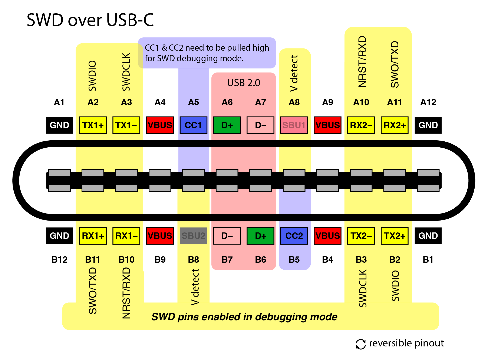
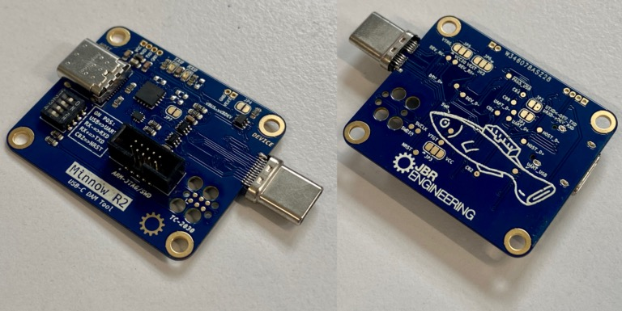
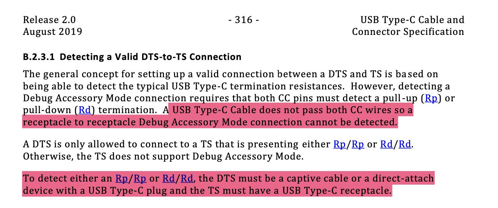

# Minnow - USB-C DAM Tool

Minnow is a tool for using DAM (Debug Accessory Mode), providing an interface to the SWD/JTAG and/or UART from the device. It expands upon [this concept](https://github.com/BitterAndReal/SWD-over-USB-C) to include a USB-UART and some utility for use within test rigs. It could be considered SWD over DAM with a sprinkling of [USB cereal](https://github.com/oxda/usb-cereal) - unlike usb-cereal it does not use the Chomebook UART mapping in favour of maintaining USB-C rotational symmetry.

* Enables and interfaces USB DAM configured in image below; SWD/JTAG over USB-C.
* Provides board designer the option of using RX+ for NRST/RXD and RX- for SWO/TXD - either single-wire trace communication or UART.
* Four configurable GPIO on FT230 for test rig control of UUT: power enable; RX pin control; reset.
* TagConnect TC2030 and ARM 10-pin header to debugger.
* USB pass-through or FT230 USB UART to device.
* VTARGET reference from device or external.
* Maintains USB-C rotational symmetry.

[Orignal reference](https://github.com/BitterAndReal/SWD-over-USB-C/blob/main/images/SWD%20over%20USB-C%20Pinout-01.png) modified to include option of UART.

# Status and Obtaining

* Revision 1 is my first release to production, which I will assemble and test; the design is not yet tested.
* Following this I will make any required changes then order more assemblies and sell on Tindie.
* Since it's a development tool, it uses 0603 so can be assembled by hand.

# Usage

## Cable

If a cable is required between Minnow and the device (TS), the cable needs to be a **complete USB-C extension cable** with all [Alternate Mode](https://en.wikipedia.org/wiki/USB-C#Alternate_Mode) wires. USB 3.1+, DisplayPort, Thunderbolt and HDMI rated cables _should_ include these. Here is an example: https://thepihut.com/products/usb-c-extension-cable-for-raspberry-pi-4

USB-C extension cables are not [technically specification compliant](https://hackaday.com/2022/12/27/all-about-usb-c-illegal-adapters/) but one is required for DAM because no compliant male-male cable will supply both CC1 and CC2 between the the DTS and TS. See [USB Type-C](https://www.usb.org/sites/default/files/USB%20Type-C%20Spec%20R2.0%20-%20August%202019.pdf): B.2.3.1.

I learnt this the hard way: R1 Minnow had a recepticle for both the host and device and no cable worked to enable USB DAM using the CC pull-ups with logic AND. As the specification says, this is why a direct plug is required for USB DAM mode and why Minnow R2 now has one.

The cable to the host can be a USB 2.0.

## Example Device 

I've included an example schematic for the device end: './example-dev/usb-dam.kicad\_pro'. It can be used for testing and as a foundation for a project with DAM. There are clearly altnative design choices that can be made based on the requirements of the device but it is a good starting point. The layout was done in haste as a means to test the Minnow board!

## FAQ

### What's the default configuration? 

USB host to device; device powered; full SWD on debug headers; VCCIO from VTARGET.

### VCCIO selection

By default, VCCIO for the FT230 is supplied from VTARGET (< 10 uA current demand from logic gates) to ensure the same logic level as the target. VCCIO controls the logic level for the GPIO and UART. Cut JP5 1-2 and link 2-3 to use JP6 source - default 3V3 1-2, 2-3 VEXT for external source (1V8 for example). **If using a VCCIO source less than 3V3, one should take the LEDs out of circuit by removing R1 and R2 as they are pulled to 3V3.**

### Why aren't the UART act LEDs blinking?

Logic level is sourced from VCCIO; VTARGET from the device by default. If no device is attached, there is no logic level and so nothing to sink the LEDs or send UART for that matter. Consider this a feature not a bug since they don't blink if nothing is output/listening 🙂. To change this, VCCIO can be self-supplied with JP5 2-3 - see 'VCCIO Selection'.

### Why doesn't the FT230 USB UART work?

One must switch SW1:1 ON to enable USB -> FT230 rather than device. Also be aware that the default configuration VCCIO is supplied from the device and without this there is no logic on the UART/GPIO pins. See 'VCCIO Selection'. It's the reason I didn't include a GPIO to the device power since it would not work without an external VCCIO source.

### How can I control the device power with the FT230

First switch the VCCIO source from VTARGET - see 'VCCIO Selection' - as logic will be required without the device. Add the resistor R15 (680R or anthing to protect GPIO) to link CB3 to the load switch. It's active LOW.

### The device is powered but no DAM pins are working

The cable to the device is probably not a USB 3.1+ (or a bad one) and does not include the alternate mode pins. Use a cable tester to continuity test the cable or find a better one! See 'Cable'.

### How can I configure/use the FT230?

See [ftx-prog](https://github.com/richardeoin/ftx-prog), the main [FTDI utilities page](https://ftdichip.com/utilities/) or the [pyftdi module](https://eblot.github.io/pyftdi/tools.html). The GPIO pins can be changed at runtime or non-volatile with the EEPROM - see './power-gpio.py' as an example of toggling power to the device.

I personally use the 'ftconf.py' script as part of _pyftdi_ to provision new devices using './provision.py'.

# Useful Links

* [SWD over USB-C](https://github.com/BitterAndReal/SWD-over-USB-C)
* [USB Type-C](https://www.usb.org/sites/default/files/USB%20Type-C%20Spec%20R2.0%20-%20August%202019.pdf)
* [ARM JTAG/SWD Interface](https://developer.arm.com/documentation/101636/0100/Debug-and-Trace/JTAG-SWD-Interface)
* [FT230X datasheet](https://www.ftdichip.com/Support/Documents/DataSheets/ICs/DS_FT230X.pdf)
